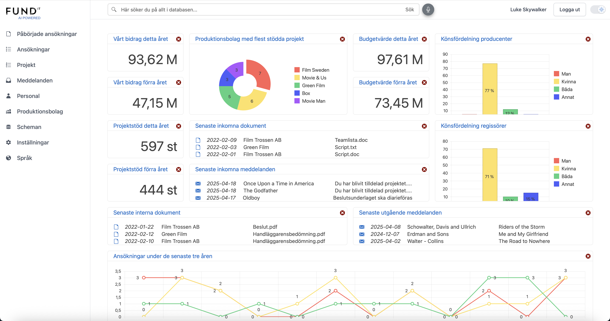
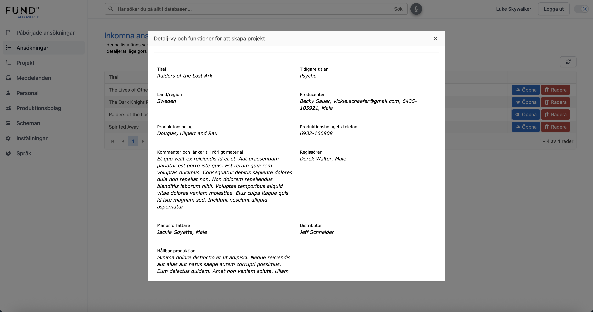
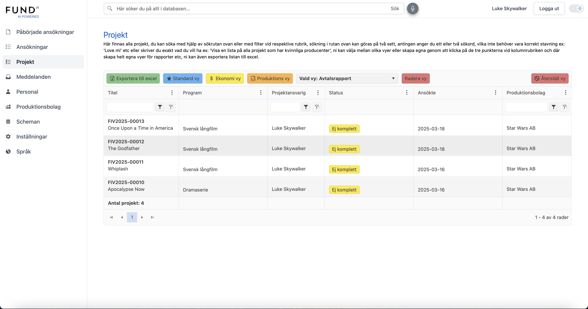
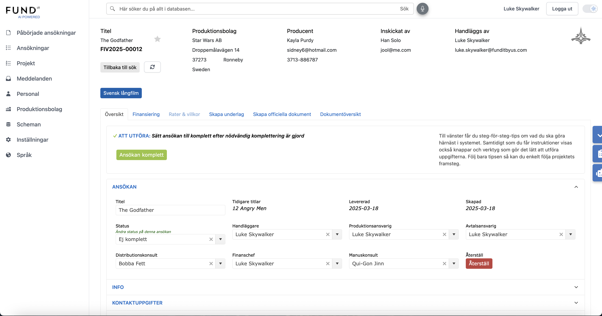

# OpenFundit

OpenFundit is an open source platform for managing film and TV production funding applications. The project is based on .NET and Blazor.

## Features
- Application management for film/TV funding
- User and role management
- Event and milestone tracking
- Email notifications
- API integrations (OpenAI, Google Drive, etc.)

## Live Demo

You can try OpenFundit right now with our public demo instances:

- **Admin Demo**: https://admindemo.funditbyus.live4.se - Full administrative interface for managing applications and projects
- **Client Demo**: https://clientdemo.funditbyus.live4.se - Client-facing interface for submitting and tracking funding applications

These demos showcase the complete functionality of the OpenFundit platform. Feel free to explore all features and see how the system works in practice.

For more information about the project and commercial services, visit our website: **https://funditbyus.com**

## Screenshots

Here's what the OpenFundit system looks like when running:

### Dashboard Overview
The main dashboard provides an overview of all funding applications and their current status.



### Applications Management
Manage and track all funding applications with detailed filtering and search capabilities.



### Project Overview
View and manage individual projects with comprehensive project information and funding details.



### Detailed Project View
Access detailed project information including budget breakdowns, milestones, and documentation.



## Getting Started
1. Clone the repository
2. Restore dependencies: `dotnet restore`
3. Update your local `appsettings.Development.json` files with your own secrets (these are excluded from version control)
4. Build and run: `dotnet build` and `dotnet run` in the desired project folder
5. We will complement the documentation with more details on how to run the project locally and in production as soon as possible.

## Deployment: Docker Swarm (Linux Cluster)

### Prepare Directories
Create necessary directories for persistent storage and set permissions:

```sh
sudo mkdir -p /mnt/hot/docker/openfundit/dpk
sudo mkdir -p /mnt/hot/docker/openfundit/org
sudo mkdir -p /mnt/hot/docker/openfundit/temp
sudo mkdir -p /mnt/hot/docker/openfundit/documents
sudo mkdir -p /mnt/hot/docker/openfundit/templates
sudo chmod -R 777 /mnt/hot/docker/openfundit
```

### Build and Publish
Publish your .NET applications as single files:

```sh
dotnet publish -c Release /p:PublishTrimmed=true /p:UseAppHost=false /p:PublishSingleFile=true
```

### Docker Images
Build, tag, and push your images to your registry:

```sh
docker build -t <your_registry>/openfundit_admin:latest ./src/AppAdmin
# Repeat for AppClient, Server, OpenAiGateway

docker push <your_registry>/openfundit_admin:latest
# Repeat for other services
```

### Example docker-compose-stack.yml
Below is a simplified example. Adjust image names, volumes, and environment variables as needed:

```yaml
version: '3.9'
services:
  admin:
    image: <your_registry>/openfundit_admin:latest
    environment:
      - ASPNETCORE_ENVIRONMENT=Release
      - ASPNETCORE_URLS=https://+:443;http://+:80
    volumes:
      - /mnt/hot/docker/openfundit/admindemo-appsettings.json:/app/appsettings.json:rw
      - /mnt/hot/docker/openfundit/documents:/app/documents:rw
      - /mnt/hot/docker/openfundit/templates:/app/Templates:rw
      - /mnt/hot/docker/openfundit/temp:/app/data/temp:rw
    networks:
      - web
      - sql_overlay
    expose:
      - "443"
  # Repeat for client, server, openaigateway
networks:
  web:
    external: true
  sql_overlay:
    external: true
```

### Deploy the Stack

```sh
docker stack deploy -c /mnt/hot/docker/openfundit/docker-compose-stack.yml openfundit
```

### Update or Remove the Stack

```sh
docker service update --force openfundit_admin
# Repeat for other services

docker stack rm openfundit
```

### Clean Up Unused Resources

```sh
docker system prune -a --volumes -f
```

> **Note:** Replace `<your_registry>` and file paths with your actual values. Place your own appsettings.json files and SSL certificates as needed. Never commit secrets to the repository.

## Contributing
Contributions are welcome! Please fork the repository and submit a pull request.

## License and Third-Party Components

**Important**: This project uses commercial components that require licenses for commercial use.

### Project License
This project is licensed under the MIT License. See the [LICENSE](LICENSE) file for details.

### Third-Party Components
This project includes commercial components from Telerik and Syncfusion that require separate licenses:

- **Telerik UI for Blazor**: Commercial license required (free for open source projects)
- **Syncfusion Blazor Components**: Commercial license required (free for qualifying developers)
- **Telerik Document Processing**: Commercial license required

See [THIRD_PARTY_LICENSES.md](THIRD_PARTY_LICENSES.md) for detailed information about all third-party dependencies and their license requirements.

### Quick Start for Open Source Projects
If you're using this for an open source project:
1. Apply for free Telerik open source license at https://www.telerik.com/blazor-ui
2. Apply for free Syncfusion community license at https://www.syncfusion.com/blazor-components
3. Configure your credentials in `src/Common/NuGet.config`

### Commercial Use
For commercial use, you must purchase appropriate licenses for all commercial components. Contact the respective vendors for pricing and licensing terms.
